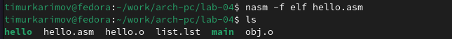
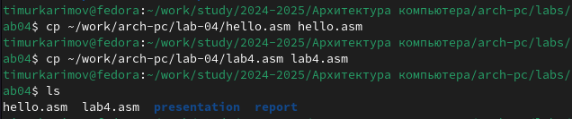

---
## Front matter
title: "Отчёт по лабораторной работе №4"
subtitle: "Простейший вариант"
author: "Тимур Ринатович Каримов"

## Generic otions
lang: ru-RU
toc-title: "Содержание"

## Bibliography
bibliography: bib/cite.bib
csl: pandoc/csl/gost-r-7-0-5-2008-numeric.csl

## Pdf output format
toc: true # Table of contents
toc-depth: 2
lof: true # List of figures
lot: true # List of tables
fontsize: 12pt
linestretch: 1.5
papersize: a4
documentclass: scrreprt
## I18n polyglossia
polyglossia-lang:
  name: russian
  options:
	- spelling=modern
	- babelshorthands=true
polyglossia-otherlangs:
  name: english
## I18n babel
babel-lang: russian
babel-otherlangs: english
## Fonts
mainfont: IBM Plex Serif
romanfont: IBM Plex Serif
sansfont: IBM Plex Sans
monofont: IBM Plex Mono
mathfont: STIX Two Math
mainfontoptions: Ligatures=Common,Ligatures=TeX,Scale=0.94
romanfontoptions: Ligatures=Common,Ligatures=TeX,Scale=0.94
sansfontoptions: Ligatures=Common,Ligatures=TeX,Scale=MatchLowercase,Scale=0.94
monofontoptions: Scale=MatchLowercase,Scale=0.94,FakeStretch=0.9
mathfontoptions:
## Biblatex
biblatex: true
biblio-style: "gost-numeric"
biblatexoptions:
  - parentracker=true
  - backend=biber
  - hyperref=auto
  - language=auto
  - autolang=other*
  - citestyle=gost-numeric
## Pandoc-crossref LaTeX customization
figureTitle: "Рис."
tableTitle: "Таблица"
listingTitle: "Листинг"
lofTitle: "Список иллюстраций"
lotTitle: "Список таблиц"
lolTitle: "Листинги"
## Misc options
indent: true
header-includes:
  - \usepackage{indentfirst}
  - \usepackage{float} # keep figures where there are in the text
  - \floatplacement{figure}{H} # keep figures where there are in the text
---

# Цель работы

Цель данной лабораторной работы заключается в изучении процесса компиляции и сборки программ, написанных на ассемблере NASM.

# Задание

Здесь приводится описание задания в соответствии с рекомендациями
методического пособия и выданным вариантом.

# Теоретическое введение

Здесь описываются теоретические аспекты, связанные с выполнением работы.

Например, в табл. [-@tbl:std-dir] приведено краткое описание стандартных каталогов Unix.

: Описание некоторых каталогов файловой системы GNU Linux {#tbl:std-dir}

| Имя каталога | Описание каталога                                                                                                          |
|--------------|----------------------------------------------------------------------------------------------------------------------------|
| `/`          | Корневая директория, содержащая всю файловую                                                                               |
| `/bin `      | Основные системные утилиты, необходимые как в однопользовательском режиме, так и при обычной работе всем пользователям     |
| `/etc`       | Общесистемные конфигурационные файлы и файлы конфигурации установленных программ                                           |
| `/home`      | Содержит домашние директории пользователей, которые, в свою очередь, содержат персональные настройки и данные пользователя |
| `/media`     | Точки монтирования для сменных носителей                                                                                   |
| `/root`      | Домашняя директория пользователя  `root`                                                                                   |
| `/tmp`       | Временные файлы                                                                                                            |
| `/usr`       | Вторичная иерархия для данных пользователя                                                                                 |

Более подробно про Unix см. в [@tanenbaum_book_modern-os_ru; @robbins_book_bash_en; @zarrelli_book_mastering-bash_en; @newham_book_learning-bash_en].

# Выполнение лабораторной работы

Напишем простую программу на ассемблере, которая выводит приветсвенное сообщение *Hello, World!*. Создадим каталог для работы с программам и перейдем в него.(рис [-@fig:001])

{#fig:001 width=70%}

Далее создадим текстовый файл с названием *hello.asm* и откроем его с помощью текстового редактора gedit(рис [-@fig:002])

{#fig:002 width=70%}

Скомпилируем текст программы *Hello, World!*. Затем посмотрим преобразовал ли транслятор текст программы из файла hello.asm в объектный код, который запишется в файл hello.o с помощью команды ls.(рис. [-@fig:003])

{#fig:003 width=70%}

Скомпилируем файл hello.asm, создавая объектный файл obj.o в формате ELF, генерируя отладочную информацию и записывая список ассемблирования в файл list.lst.(рис. [-@fig:004])

{#fig:004 width=70%}

Передадим объектный файл на обработку компоновщику, чтобы получить исполняемую программу.
Сделаем так же исполняемый файл и объектный файл с названиями obj.o и main соответственно.(рис. [-@fig:005])

{#fig:005 width=70%}

Наконец, запустим исполняемый файл.(рис. [-@fig:006])

{#fig:006 width=70%}

**Приступим к выполнению самостоятельной работы**

Создадим копию файла hello.asm с именем lab4.asm в каталоге ~/work/arch-pc/lab04.
(рис. [-@fig:007])

{#fig:007 width=70%}

Отредактурем с помощью gedit, чтобы вместо *Hello, World!* на экран выводилась моя фамилия с именем. Оттранслируем полученный текст программы lab4.asm в объектный файл.(рис. [-@fig:008])

{#fig:008 width=70%}

Выполним компоновку объектного файла и запустим получившийся исполняемый файл.(рис. [-@fig:009])

{#fig:009 width=70%}

Скопируем файлы hello.asm и lab4.asm по ветке ~/work/study/2024-2025/"Архитектура компьютера"/arch-pc/labs/lab04/.(рис. [-@fig:010])

{#fig:010 width=70%}

Загрузка файлов на GitHub.(рис. [-@fig:011])(рис. [-@fig:012])

{#fig:011 width=70%}

{#fig:012 width=70%}

# Выводы

В ходе лабораторной работы №4, посвященной созданию и обработке программ на языке ассемблера NASM, была успешно освоена процедура компиляции и сборки ассемблерных программ. Мы изучили ключевые этапы, включая написание исходного кода, его компиляцию с помощью *NASM* и линковку для получения исполняемого файла. 

# Список литературы{.unnumbered}

::: {#refs}
:::
