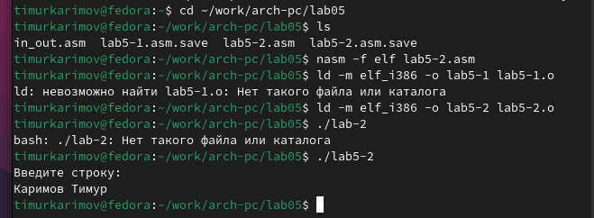

---
## Front matter
title: "Отчёт по лабораторной работе"
subtitle: "Простейший вариант"
author: "Тимур Ринатович Каримов"

## Generic otions
lang: ru-RU
toc-title: "Содержание"

## Bibliography
bibliography: bib/cite.bib
csl: pandoc/csl/gost-r-7-0-5-2008-numeric.csl

## Pdf output format
toc: true # Table of contents
toc-depth: 2
lof: true # List of figures
lot: true # List of tables
fontsize: 12pt
linestretch: 1.5
papersize: a4
documentclass: scrreprt
## I18n polyglossia
polyglossia-lang:
  name: russian
  options:
	- spelling=modern
	- babelshorthands=true
polyglossia-otherlangs:
  name: english
## I18n babel
babel-lang: russian
babel-otherlangs: english
## Fonts
mainfont: IBM Plex Serif
romanfont: IBM Plex Serif
sansfont: IBM Plex Sans
monofont: IBM Plex Mono
mathfont: STIX Two Math
mainfontoptions: Ligatures=Common,Ligatures=TeX,Scale=0.94
romanfontoptions: Ligatures=Common,Ligatures=TeX,Scale=0.94
sansfontoptions: Ligatures=Common,Ligatures=TeX,Scale=MatchLowercase,Scale=0.94
monofontoptions: Scale=MatchLowercase,Scale=0.94,FakeStretch=0.9
mathfontoptions:
## Biblatex
biblatex: true
biblio-style: "gost-numeric"
biblatexoptions:
  - parentracker=true
  - backend=biber
  - hyperref=auto
  - language=auto
  - autolang=other*
  - citestyle=gost-numeric
## Pandoc-crossref LaTeX customization
figureTitle: "Рис."
tableTitle: "Таблица"
listingTitle: "Листинг"
lofTitle: "Список иллюстраций"
lotTitle: "Список таблиц"
lolTitle: "Листинги"
## Misc options
indent: true
header-includes:
  - \usepackage{indentfirst}
  - \usepackage{float} # keep figures where there are in the text
  - \floatplacement{figure}{H} # keep figures where there are in the text
---

# Цель работы

Цель данной лабораторной работы заключается в изучении основ работы с текстовым интерфейсом файлового менеджера Midnight Commander (mc), а также в освоении структуры и синтаксиса программы на языке ассемблера NASM. В ходе выполнения лабораторной работы студенты познакомятся с различными командами и операциями, доступными в mc, а также научатся работать с данными в секциях bss и data, а также разберутся в использовании инструкций языка ассемблера.

# Задание

1) Выполнение лабораторной работы
2) Подключение внешнего файла in_out.asm
3) Выполнения самостоятельной работы

# Теоретическое введение

Здесь описываются теоретические аспекты, связанные с выполнением работы.

Например, в табл. [-@tbl:std-dir] приведено краткое описание стандартных каталогов Unix.

: Описание некоторых каталогов файловой системы GNU Linux {#tbl:std-dir}

| Имя каталога | Описание каталога                                                                                                          |
|--------------|----------------------------------------------------------------------------------------------------------------------------|
| `/`          | Корневая директория, содержащая всю файловую                                                                               |
| `/bin `      | Основные системные утилиты, необходимые как в однопользовательском режиме, так и при обычной работе всем пользователям     |
| `/etc`       | Общесистемные конфигурационные файлы и файлы конфигурации установленных программ                                           |
| `/home`      | Содержит домашние директории пользователей, которые, в свою очередь, содержат персональные настройки и данные пользователя |
| `/media`     | Точки монтирования для сменных носителей                                                                                   |
| `/root`      | Домашняя директория пользователя  `root`                                                                                   |
| `/tmp`       | Временные файлы                                                                                                            |
| `/usr`       | Вторичная иерархия для данных пользователя                                                                                 |

Более подробно про Unix см. в [@tanenbaum_book_modern-os_ru; @robbins_book_bash_en; @zarrelli_book_mastering-bash_en; @newham_book_learning-bash_en].

# Выполнение лабораторной работы

Откроем Midnight commander с помощью команды *mc*, перейдем в каталог ~/work/arch-pc и создадим папку lab05(рис. [-@fig:001]).

{#fig:001 width=70%}

Создадим файл lab5-1.ams с помощью команды *touch*(рис. [-@fig:002]).

{#fig:002 width=70%}

Открытие файла lab5-1.asm с помощью функциональной клавиши *f4*(рис. [-@fig:003]).

{#fig:003 width=70%}

Введем текст программы из листинга 5.1(рис. [-@fig:004]).

{#fig:004 width=70%}

Просмотр содержимого файла *lab5-1.asm*(рис. [-@fig:005]).

{#fig:005 width=70%}

Оттранслируем исходный код из файла lab5-1.asm в объектный файл, затем выполним компоновку этого объектного файла и запустим его.(рис. [-@fig:006]).

{#fig:006 width=70%}

Скачиваем файл in_out.asm со страницы курса ТУИС и копируем его в тот же каталог, что файл с программой.(рис. [-@fig:007]).

{#fig:007 width=70%}

Исправим текст программы lab5-2.asm в соответствие с листингом 5.2(рис. [-@fig:008]) и проверим его работу(рис. [-@fig:009])

{#fig:008 width=70%}

{#fig:009 width=70%}

Затем заменим в файле lab5-2.asm подпрограмму sprintLF на sprint(рис. [-@fig:010]) и проверим работу этого файла.(рис. [-@fig:011])

{#fig:010 width=70%}

{#fig:011 width=70%}

**Приступим к выполнению самостоятельной работы**

Создадим копию файла lab5-1.asm под названием lab5-11.asm.(рис. [-@fig:012]).

{#fig:012 width=70%}

Внесеми изменения в соответствии с данным алгоритмом.(рис. [-@fig:013]).

{#fig:013 width=70%}

Проверим работу созданного файла.(рис. [-@fig:014]).

{#fig:014 width=70%}

Создадим копию файла lab5-2.asm под названием lab5-22.asm.(рис. [-@fig:015]).

{#fig:015 width=70%}

Внесеми изменения в соответствии с данным алгоритмом.(рис. [-@fig:016]).

{#fig:016 width=70%}

Проверим работу созданного файла.(рис. [-@fig:017]).

{#fig:017 width=70%}

# Выводы

В ходе лабораторной работы студенты получили практические навыки работы с mc и изучили основы ассемблера NASM. Были приобретены навыки использования внешних файлов, значительно упрощающих написание кода.

# Список литературы{.unnumbered}

::: {#refs}
:::
