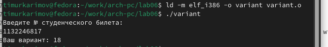

---
## Front matter
title: "Отчёт по лабораторной работе"
subtitle: "Простейший вариант"
author: "Тимур Ринатович Каримов"

## Generic otions
lang: ru-RU
toc-title: "Содержание"

## Bibliography
bibliography: bib/cite.bib
csl: pandoc/csl/gost-r-7-0-5-2008-numeric.csl

## Pdf output format
toc: true # Table of contents
toc-depth: 2
lof: true # List of figures
lot: true # List of tables
fontsize: 12pt
linestretch: 1.5
papersize: a4
documentclass: scrreprt
## I18n polyglossia
polyglossia-lang:
  name: russian
  options:
	- spelling=modern
	- babelshorthands=true
polyglossia-otherlangs:
  name: english
## I18n babel
babel-lang: russian
babel-otherlangs: english
## Fonts
mainfont: IBM Plex Serif
romanfont: IBM Plex Serif
sansfont: IBM Plex Sans
monofont: IBM Plex Mono
mathfont: STIX Two Math
mainfontoptions: Ligatures=Common,Ligatures=TeX,Scale=0.94
romanfontoptions: Ligatures=Common,Ligatures=TeX,Scale=0.94
sansfontoptions: Ligatures=Common,Ligatures=TeX,Scale=MatchLowercase,Scale=0.94
monofontoptions: Scale=MatchLowercase,Scale=0.94,FakeStretch=0.9
mathfontoptions:
## Biblatex
biblatex: true
biblio-style: "gost-numeric"
biblatexoptions:
  - parentracker=true
  - backend=biber
  - hyperref=auto
  - language=auto
  - autolang=other*
  - citestyle=gost-numeric
## Pandoc-crossref LaTeX customization
figureTitle: "Рис."
tableTitle: "Таблица"
listingTitle: "Листинг"
lofTitle: "Список иллюстраций"
lotTitle: "Список таблиц"
lolTitle: "Листинги"
## Misc options
indent: true
header-includes:
  - \usepackage{indentfirst}
  - \usepackage{float} # keep figures where there are in the text
  - \floatplacement{figure}{H} # keep figures where there are in the text
---

# Цель работы

Освоение арифметических инструкций языка ассемблера NASM

# Задание

1) Выполнение лабораторной работы
2) Ответы на вопросы
3) Выполнение самостоятельной работы

# Теоретическое введение

Здесь описываются теоретические аспекты, связанные с выполнением работы.

Например, в табл. [-@tbl:std-dir] приведено краткое описание стандартных каталогов Unix.

: Описание некоторых каталогов файловой системы GNU Linux {#tbl:std-dir}

| Имя каталога | Описание каталога                                                                                                          |
|--------------|----------------------------------------------------------------------------------------------------------------------------|
| `/`          | Корневая директория, содержащая всю файловую                                                                               |
| `/bin `      | Основные системные утилиты, необходимые как в однопользовательском режиме, так и при обычной работе всем пользователям     |
| `/etc`       | Общесистемные конфигурационные файлы и файлы конфигурации установленных программ                                           |
| `/home`      | Содержит домашние директории пользователей, которые, в свою очередь, содержат персональные настройки и данные пользователя |
| `/media`     | Точки монтирования для сменных носителей                                                                                   |
| `/root`      | Домашняя директория пользователя  `root`                                                                                   |
| `/tmp`       | Временные файлы                                                                                                            |
| `/usr`       | Вторичная иерархия для данных пользователя                                                                                 |

Более подробно про Unix см. в [@tanenbaum_book_modern-os_ru; @robbins_book_bash_en; @zarrelli_book_mastering-bash_en; @newham_book_learning-bash_en].

# Выполнение лабораторной работы

Создаем каталог для программ лабораторной №6. Переходим в него и создаем файл lab6-1.asm (рис. [-@fig:001])

{#fig:001 width=70%}

Ввожу в созданный файл текст программы из листинга (рис. [-@fig:002])

{#fig:002 width=70%}

Создаем исполняемый файл и запускаем его(рис. [-@fig:003])

{#fig:003 width=70%}

Изменяем текст программы, вместо символов записываем в eax, ebx числа (рис. [-@fig:004])

{#fig:004 width=70%}

Создаем исполняемый файл и запускаем его (рис. [-@fig:005])

{#fig:005 width=70%}

На экране две пустые строки. Это связано с тем, что символ с кодом 10 

\- это символ перевода строки.

Создаем файл lab6-2.asm в каталоге для программ лабораторной №6. Ввожу в него текст программы из листинга 6.2 (рис. [-@fig:006])

{#fig:006 width=70%}

Создаем исполняемый файл и запускаем его (рис. [-@fig:007])

{#fig:007 width=70%}

Аналогично предыдущей программе заменяем символы на числа (рис. [-@fig:008])

{#fig:008 width=70%}

Создаем исполняемый файл и запускаем его (рис. [-@fig:009])

{#fig:009 width=70%}

Теперь программа складывает не коды, соответствующие символам, а сами числа. Поэтому выводит число 10 - сумму чисел 4 и 6.

Заменяем функцию iprintLF на iprint (рис. [-@fig:010])

{#fig:010 width=70%}

Создаем исполняемый файл и запускаем его(рис. [-@fig:011])

{#fig:011 width=70%}

Вывод функции iprintLF от вывода функции iprint отличается тем, что в последнем случае после вывода не добавляется переход на новую строку.

2. **Выполнение арифметических операций в Nasm**
1. Создаем файл lab6-3.asm. Вводим в него текст программы для вычисления значения указанного выражения (рис. [-@fig:012])

{#fig:012 width=70%}

2. Создаем исполняемый файл и запускаем его (рис. [-@fig:013])

{#fig:013 width=70%}

Изменяем текст программы для вычисления нового выражения (рис. [-@fig:014])

{#fig:014 width=70%}

Создаем исполняемый файл и запускаем его (рис. [-@fig:015])

{#fig:015 width=70%}

С помощью утилиты touch создаем файл variant.asm. Вводим в него текст программы для вычисления варианта (рис. [-@fig:016])

{#fig:016 width=70%}

Создаем исполняемый файл и запускаем его (рис. [-@fig:017])

{#fig:017 width=70%}

Ответы на вопросы по программе: 
1. За вывод сообщения “Ваш вариант” отвечают

строки кода:

mov eax,rem

call sprint

2. Инструкция mov ecx, x выполняется для того чтобы положить адрес вводимой строки x в регистр ecx. Инструкция mov edx, 80 выполняется для записи длины вводимой строки в регистр edx. Инструкция call sread выполняется для вызова подпрограммы из внешнего файла, обеспечивающей ввод сообщения с клавиатуры.
3. Инструкция call atoi используется для вызова подпрограммы из внешнего файла, которая преобразует ascii-код символа в целое число и записывает результат в регистр eax.
4. За вычисление варианта отвечают строки:
*xor edx, edx*

*mov ebx, 20*

*div ebx*

*inc edx*

5. При выполнении инструкции div ebx остаток от деления записывается в регистр edx.
6. Инструкция inc edx увеличивает значение регистра edx на 1.
7. За вывод на экран результата вычислений отвечаю следующие строки:
*mov eax, edx*
*call iprintLF*
#Выполнение самостоятельной работы

Создаем файл lab6-4.asm и записываем в него программу для вычисления выражения 18 варианта. (рис. [-@fig:018])

{#fig:018 width=70%}

Создаем исполняемый файл и проверяем его работу для указанных значений (рис. [-@fig:019])

{#fig:019 width=70%}

# Выводы

При выполении лабораторной работы помогла освоению арифметических инструкций языка ассемблера NASM.

# Список литературы{.unnumbered}

::: {#refs}
:::

