---
## Front matter
title: "Отчёт по лабораторной работе"
subtitle: "Простейший вариант"
author: "Тимур Ринатович Каримов"

## Generic otions
lang: ru-RU
toc-title: "Содержание"

## Bibliography
bibliography: bib/cite.bib
csl: pandoc/csl/gost-r-7-0-5-2008-numeric.csl

## Pdf output format
toc: true # Table of contents
toc-depth: 2
lof: true # List of figures
lot: true # List of tables
fontsize: 12pt
linestretch: 1.5
papersize: a4
documentclass: scrreprt
## I18n polyglossia
polyglossia-lang:
  name: russian
  options:
	- spelling=modern
	- babelshorthands=true
polyglossia-otherlangs:
  name: english
## I18n babel
babel-lang: russian
babel-otherlangs: english
## Fonts
mainfont: IBM Plex Serif
romanfont: IBM Plex Serif
sansfont: IBM Plex Sans
monofont: IBM Plex Mono
mathfont: STIX Two Math
mainfontoptions: Ligatures=Common,Ligatures=TeX,Scale=0.94
romanfontoptions: Ligatures=Common,Ligatures=TeX,Scale=0.94
sansfontoptions: Ligatures=Common,Ligatures=TeX,Scale=MatchLowercase,Scale=0.94
monofontoptions: Scale=MatchLowercase,Scale=0.94,FakeStretch=0.9
mathfontoptions:
## Biblatex
biblatex: true
biblio-style: "gost-numeric"
biblatexoptions:
  - parentracker=true
  - backend=biber
  - hyperref=auto
  - language=auto
  - autolang=other*
  - citestyle=gost-numeric
## Pandoc-crossref LaTeX customization
figureTitle: "Рис."
tableTitle: "Таблица"
listingTitle: "Листинг"
lofTitle: "Список иллюстраций"
lotTitle: "Список таблиц"
lolTitle: "Листинги"
## Misc options
indent: true
header-includes:
  - \usepackage{indentfirst}
  - \usepackage{float} # keep figures where there are in the text
  - \floatplacement{figure}{H} # keep figures where there are in the text
---

# Цель работы

Изучение команд условного и безусловного переходов. Приобретение навыков написания программ с использованием переходов. Знакомство с назначением и структурой файла листинга.

# Задание

1.Реализация переходов в NASM.
2.Изучение структуры файлы листинга

# Теоретическое введение

Здесь описываются теоретические аспекты, связанные с выполнением работы.

Например, в табл. [-@tbl:std-dir] приведено краткое описание стандартных каталогов Unix.

: Описание некоторых каталогов файловой системы GNU Linux {#tbl:std-dir}

| Имя каталога | Описание каталога                                                                                                          |
|--------------|----------------------------------------------------------------------------------------------------------------------------|
| `/`          | Корневая директория, содержащая всю файловую                                                                               |
| `/bin `      | Основные системные утилиты, необходимые как в однопользовательском режиме, так и при обычной работе всем пользователям     |
| `/etc`       | Общесистемные конфигурационные файлы и файлы конфигурации установленных программ                                           |
| `/home`      | Содержит домашние директории пользователей, которые, в свою очередь, содержат персональные настройки и данные пользователя |
| `/media`     | Точки монтирования для сменных носителей                                                                                   |
| `/root`      | Домашняя директория пользователя  `root`                                                                                   |
| `/tmp`       | Временные файлы                                                                                                            |
| `/usr`       | Вторичная иерархия для данных пользователя                                                                                 |

Более подробно про Unix см. в [@tanenbaum_book_modern-os_ru; @robbins_book_bash_en; @zarrelli_book_mastering-bash_en; @newham_book_learning-bash_en].

# Выполнение лабораторной работы

▎1. Создание каталога и файла(рис. [-@fig:001]).

• Создан каталог lab7.

• Внутри каталога создан файл lab7-1.asm.

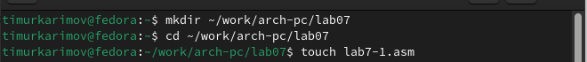{#fig:001 width=70%}

▎2. Ввод текста программы и запуск

• В файл lab7-1.asm введен текст программы(рис. [-@fig:002]).

• Программа была успешно запущена, и результат соответствовал ожиданиям(рис. [-@fig:003]).

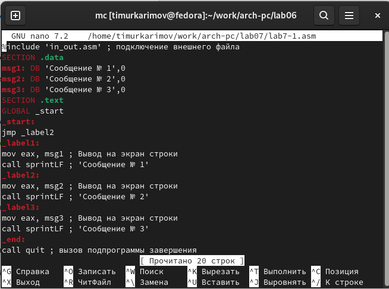{#fig:002 width=70%}

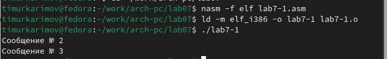{#fig:003 width=70%}

▎3. Изменение текста программы

• Изменен текст программы для получения нужного результата(рис. [-@fig:004]).

• Создан исполняемый файл и проведена проверка работы программы(рис. [-@fig:005]).

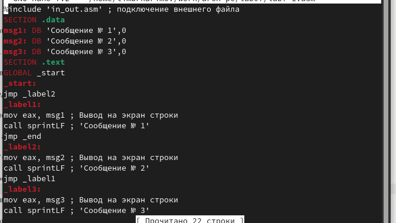{#fig:004 width=70%}

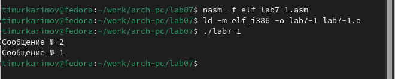{#fig:005 width=70%}

▎4. Последующие изменения

• Текст программы изменен для последовательного вывода сообщений: сначала 3, затем 2, затем 1.(рис. [-@fig:006]).

• Программа была запущена и проверена на корректность работы.(рис. [-@fig:007]).

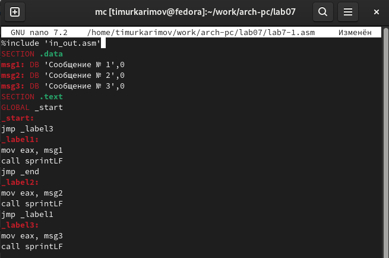{#fig:006 width=70%}

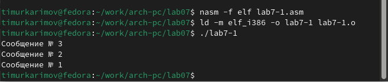{#fig:007 width=70%}

▎5. Создание нового файла

• Создан файл lab8-2.asm и написан текст программы для сравнения чисел(рис. [-@fig:008]).

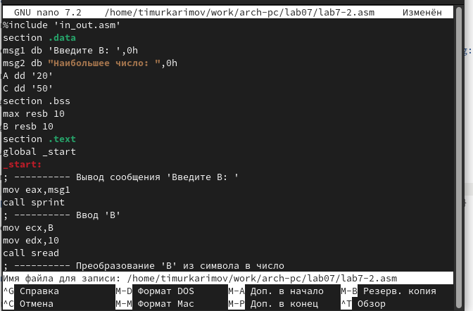{#fig:008 width=70%}

▎6. Проверка работы новой программы

• Введены два различных числа для тестирования работы программы(рис. [-@fig:009]).

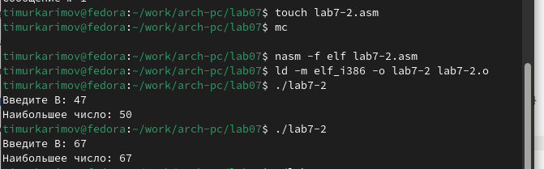{#fig:009 width=70%}

▎7. Анализ файла листинга

• Создан файл листинга lab7-2.lst и открыт для анализа(рис. [-@fig:010]).

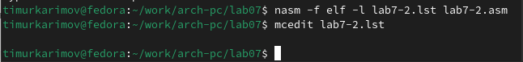{#fig:010 width=70%}

▎7.1. Объяснение строк кода из листинга.

• Строка 21(рис. [-@fig:011]).:

  • Адрес: 00000101

  • Машинный код: B8 [0A000000]

  • Описание: mov eax,B — значение переменной B загружается в регистр eax.

{#fig:011 width=70%}

• Строка 35(рис. [-@fig:012]).:

  • Адрес: 00000134

  • Машинный код: E863FFFFFF

  • Описание: call atoi — символ из предыдущей строки преобразуется в число.

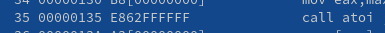{#fig:012 width=70%}

• Строка 47(рис. [-@fig:013]).:

  • Адрес: 00000162

  • Машинный код: A1 [00000000]

  • Описание: mov eax,[max] — значение переменной max загружается в регистр eax.

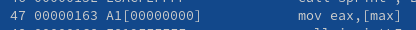{#fig:013 width=70%}

▎8. Ошибка при компиляции

• Удалена переменная max из строки mov eax,max.

• При попытке создать исполняемый файл возникла ошибка из-за отсутствия второго операнда(рис. [-@fig:014]).

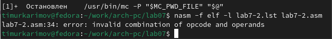{#fig:014 width=70%}

▎9. Анализ ошибки

• Файл листинга указал на место ошибки и объяснил ее причины(рис. [-@fig:015]).

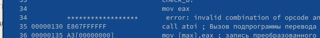{#fig:015 width=70%}

#Самостоятельная работа.

• Написана программа для нахождения меньшего из трех чисел с вводом чисел с клавиатуры (вариант 18, числа: 30, 73, 83)(рис. [-@fig:016]). Программа успешно вывела меньшее из этих чисел(рис. [-@fig:017]).

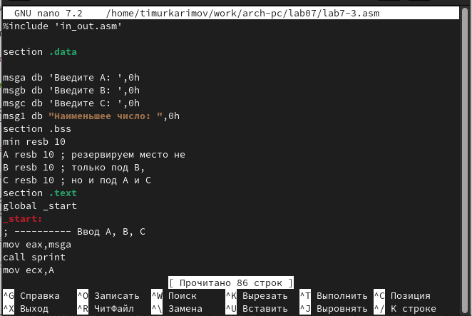{#fig:016 width=70%}

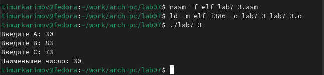{#fig:017 width=70%}

• Написана программа для вычисления выражения при введенных значениях X и A с выводом формулы в начале работы программы (вариант 18)(рис. [-@fig:018])(рис. [-@fig:019]).

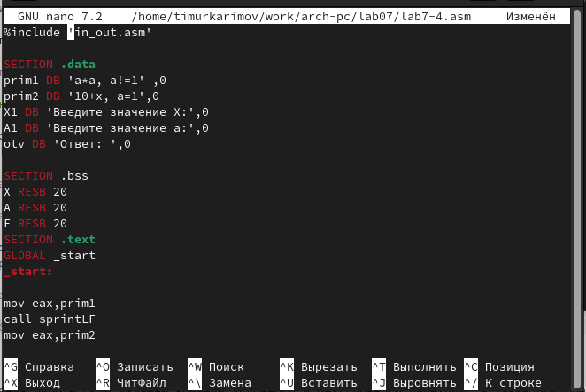{#fig:018 width=70%}

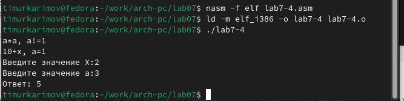{#fig:019 width=70%}

# Выводы

В ходе выполнения работы были изучены команды условного и безусловного перехода, а также приобретены навыки написания программ с использованием этих команд. Работа с ассемблером позволила глубже понять основы низкоуровневого программирования и взаимодействия с аппаратным обеспечением компьютера.

# Список литературы{.unnumbered}

::: {#refs}
:::
