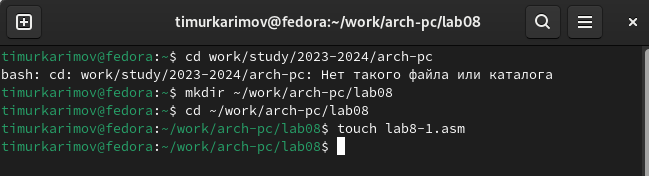

---
## Front matter
title: "Отчёт по лабораторной работе"
subtitle: "Простейший вариант"
author: "Тимур Ринатович Каримов"

## Generic otions
lang: ru-RU
toc-title: "Содержание"

## Bibliography
bibliography: bib/cite.bib
csl: pandoc/csl/gost-r-7-0-5-2008-numeric.csl

## Pdf output format
toc: true # Table of contents
toc-depth: 2
lof: true # List of figures
lot: true # List of tables
fontsize: 12pt
linestretch: 1.5
papersize: a4
documentclass: scrreprt
## I18n polyglossia
polyglossia-lang:
  name: russian
  options:
	- spelling=modern
	- babelshorthands=true
polyglossia-otherlangs:
  name: english
## I18n babel
babel-lang: russian
babel-otherlangs: english
## Fonts
mainfont: IBM Plex Serif
romanfont: IBM Plex Serif
sansfont: IBM Plex Sans
monofont: IBM Plex Mono
mathfont: STIX Two Math
mainfontoptions: Ligatures=Common,Ligatures=TeX,Scale=0.94
romanfontoptions: Ligatures=Common,Ligatures=TeX,Scale=0.94
sansfontoptions: Ligatures=Common,Ligatures=TeX,Scale=MatchLowercase,Scale=0.94
monofontoptions: Scale=MatchLowercase,Scale=0.94,FakeStretch=0.9
mathfontoptions:
## Biblatex
biblatex: true
biblio-style: "gost-numeric"
biblatexoptions:
  - parentracker=true
  - backend=biber
  - hyperref=auto
  - language=auto
  - autolang=other*
  - citestyle=gost-numeric
## Pandoc-crossref LaTeX customization
figureTitle: "Рис."
tableTitle: "Таблица"
listingTitle: "Листинг"
lofTitle: "Список иллюстраций"
lotTitle: "Список таблиц"
lolTitle: "Листинги"
## Misc options
indent: true
header-includes:
  - \usepackage{indentfirst}
  - \usepackage{float} # keep figures where there are in the text
  - \floatplacement{figure}{H} # keep figures where there are in the text
---

# Цель работы

Приобретение навыков написания программ с использованием циклов и обработки аргументов командной строки.

# Задание

1)Выполнение лабораторной работы

2)Выполнение самостоятельной работы 

# Теоретическое введение

Здесь описываются теоретические аспекты, связанные с выполнением работы.

Например, в табл. [-@tbl:std-dir] приведено краткое описание стандартных каталогов Unix.

: Описание некоторых каталогов файловой системы GNU Linux {#tbl:std-dir}

| Имя каталога | Описание каталога                                                                                                          |
|--------------|----------------------------------------------------------------------------------------------------------------------------|
| `/`          | Корневая директория, содержащая всю файловую                                                                               |
| `/bin `      | Основные системные утилиты, необходимые как в однопользовательском режиме, так и при обычной работе всем пользователям     |
| `/etc`       | Общесистемные конфигурационные файлы и файлы конфигурации установленных программ                                           |
| `/home`      | Содержит домашние директории пользователей, которые, в свою очередь, содержат персональные настройки и данные пользователя |
| `/media`     | Точки монтирования для сменных носителей                                                                                   |
| `/root`      | Домашняя директория пользователя  `root`                                                                                   |
| `/tmp`       | Временные файлы                                                                                                            |
| `/usr`       | Вторичная иерархия для данных пользователя                                                                                 |

Более подробно про Unix см. в [@tanenbaum_book_modern-os_ru; @robbins_book_bash_en; @zarrelli_book_mastering-bash_en; @newham_book_learning-bash_en].

# Выполнение лабораторной работы

1. Создание каталога и файла

   • Создан каталог lab9 и файл lab9-1.asm (рис. [-@fig:001]).
   
{#fig:001 width=70%}

2. Ввод текста первой программы ее запуск

   • В файл был введен текст первой программы (рис. [-@fig:002]).
   
{#fig:002 width=70%}
   
   • Был создан исполняемый файл. После этого программа была успешно запущена, и результаты работы были проверены. (рис. [-@fig:003]).
  
{#fig:003 width=70%}

3. Модификация программы

   • В теле цикла добавлена строка *sub eax, 1*(рис. [-@fig:004]), что привело к возникновению бесконечного цикла (рис. [-@fig:005]).
   
{#fig:004 width=70%}

{#fig:005 width=70%}

4. Корректировка работы цикла.

   • Внесены изменения в текст программы для правильной работы цикла и счетчика. Количество проходов цикла стало соответствовать числу, введенному с клавиатуры (рис. [-@fig:006]).
   
{#fig:006 width=70%}

   • Программа была успешно запущена с новыми изменениями (рис. [-@fig:007]).
   
{#fig:007 width=70%}

5. Создание новой программы для вывода аргументов

   • Создан файл lab8-2.asm, в который введен код программы, выводящей все аргументы, введенные пользователем(рис. [-@fig:008]). Программа корректно отобразила все три введенных аргумента в различных вариациях.
   
{#fig:008 width=70%}

   • Программа была успешно выполнена, и результаты были зафиксированы (рис. [-@fig:009]).
 
{#fig:009 width=70%}

6. Создание программы для суммирования чисел

   • Создан файл lab9-3.asm, введен текст программы (рис. [-@fig:010]) и выполнен запуск. Программа вывела сумму введенных чисел.

{#fig:010 width=70%}

   • Результаты выполнения программы были успешно получены и зафиксированы (рис. [-@fig:011]).
   
{#fig:011 width=70%}

7. Модификация программы для произведения чисел

    • Программа была изменена для вывода произведения введенных чисел (рис. [-@fig:012]).
    
{#fig:012 width=70%}

    • Измененный текст программы был сохранен, и программа была запущена. Результаты выполнения программы были успешно получены и задокументированы (рис. [-@fig:013]).
    
{#fig:013 width=70%}

# Самостоятельная работа

Пишем программу в соответствие с полученными данными из Лабораторной работы №7. Проверям программу на случайных числах (рис. [-@fig:014]). Создаем программу, которая выводит сумму всех решений (рис. [-@fig:015]).

{#fig:014 width=70%}

{#fig:015 width=70%}

# Выводы

В ходе выполнения лабораторной работы были приобретены навыки написания программ с использованием циклов и обработки аргументов командной строки. Все задачи были успешно выполнены, что подтвердило правильность работы рзработанных программ.

# Список литературы{.unnumbered}

::: {#refs}
:::
