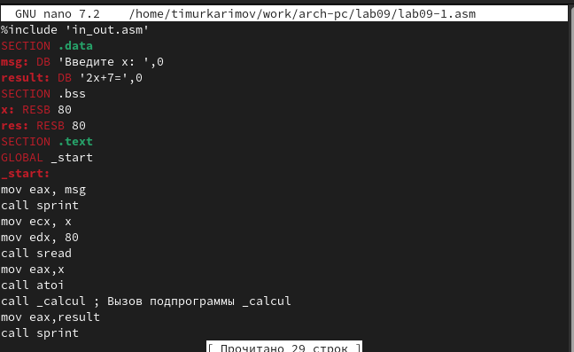

---
## Front matter
title: Отчёт по лабораторной работе"
subtitle: "Простейший вариант"
author: "Тииур Ринатович Каримов"

## Generic otions
lang: ru-RU
toc-title: "Содержание"

## Bibliography
bibliography: bib/cite.bib
csl: pandoc/csl/gost-r-7-0-5-2008-numeric.csl

## Pdf output format
toc: true # Table of contents
toc-depth: 2
lof: true # List of figures
lot: true # List of tables
fontsize: 12pt
linestretch: 1.5
papersize: a4
documentclass: scrreprt
## I18n polyglossia
polyglossia-lang:
  name: russian
  options:
	- spelling=modern
	- babelshorthands=true
polyglossia-otherlangs:
  name: english
## I18n babel
babel-lang: russian
babel-otherlangs: english
## Fonts
mainfont: IBM Plex Serif
romanfont: IBM Plex Serif
sansfont: IBM Plex Sans
monofont: IBM Plex Mono
mathfont: STIX Two Math
mainfontoptions: Ligatures=Common,Ligatures=TeX,Scale=0.94
romanfontoptions: Ligatures=Common,Ligatures=TeX,Scale=0.94
sansfontoptions: Ligatures=Common,Ligatures=TeX,Scale=MatchLowercase,Scale=0.94
monofontoptions: Scale=MatchLowercase,Scale=0.94,FakeStretch=0.9
mathfontoptions:
## Biblatex
biblatex: true
biblio-style: "gost-numeric"
biblatexoptions:
  - parentracker=true
  - backend=biber
  - hyperref=auto
  - language=auto
  - autolang=other*
  - citestyle=gost-numeric
## Pandoc-crossref LaTeX customization
figureTitle: "Рис."
tableTitle: "Таблица"
listingTitle: "Листинг"
lofTitle: "Список иллюстраций"
lotTitle: "Список таблиц"
lolTitle: "Листинги"
## Misc options
indent: true
header-includes:
  - \usepackage{indentfirst}
  - \usepackage{float} # keep figures where there are in the text
  - \floatplacement{figure}{H} # keep figures where there are in the text
---

# Цель работы

Приобретение навыков написания программ с использованием подпрограмм. Знакомство с методами откладки при помощи GDB.

# Задание

1) Выполнение лабораторной работы.

2) Выполнение самостоятельной работы.

# Теоретическое введение

Здесь описываются теоретические аспекты, связанные с выполнением работы.

Например, в табл. [-@tbl:std-dir] приведено краткое описание стандартных каталогов Unix.

: Описание некоторых каталогов файловой системы GNU Linux {#tbl:std-dir}

| Имя каталога | Описание каталога                                                                                                          |
|--------------|----------------------------------------------------------------------------------------------------------------------------|
| `/`          | Корневая директория, содержащая всю файловую                                                                               |
| `/bin `      | Основные системные утилиты, необходимые как в однопользовательском режиме, так и при обычной работе всем пользователям     |
| `/etc`       | Общесистемные конфигурационные файлы и файлы конфигурации установленных программ                                           |
| `/home`      | Содержит домашние директории пользователей, которые, в свою очередь, содержат персональные настройки и данные пользователя |
| `/media`     | Точки монтирования для сменных носителей                                                                                   |
| `/root`      | Домашняя директория пользователя  `root`                                                                                   |
| `/tmp`       | Временные файлы                                                                                                            |
| `/usr`       | Вторичная иерархия для данных пользователя                                                                                 |

Более подробно про Unix см. в [@tanenbaum_book_modern-os_ru; @robbins_book_bash_en; @zarrelli_book_mastering-bash_en; @newham_book_learning-bash_en].

# Выполнение лабораторной работы

1. Создание каталога и файла 
   Был создан каталог *lab9* и файл *lab9-1.asm* (рис. [-@fig:001]).
   
{#fig:001 width=70%}

2. Ввод текста программы и запуск 
   В файл был введен код программы *Листинг 9.1* (рис. [-@fig:002]), после чего он была запущен (рис. [-@fig:003]).

{#fig:002 width=70%}

{#fig:003 width=70%}

3. Изменение программы 
   Текст программы был изменен для решения выражения  *f(g(x))* (рис. [-@fig:004]). После внесения изменений программа была снова запущена (рис. [-@fig:005]).
   
{#fig:004 width=70%}
   
{#fig:005 width=70%}

4. Создание второго файла 
   Создан файл lab10-2.asm, в который была вписана новая программа (рис. [-@fig:006]).
   
{#fig:006 width=70%}

5. Загрузка и отладка второй программы 
   Файл второй программы был загружен и запущен в отладчике GDB (рис. [-@fig:007]).
   
{#fig:007 width=70%}
   
   Установлен брекпоинт на метку _start, после чего программа была запущена (рис. [-@fig:008]).
   
{#fig:008 width=70%}

6. Дисассемблирование кода
   Просмотрен дисассемблированный код программы, начиная с метки _start (рис. [-@fig:009]).
   
{#fig:009 width=70%}

7. Смена синтаксиса на *Intel*
   С помощью команды был переключен синтаксис на Intel. Отличие заключается в отсутствии символов *%* и *$* в командах, что делает отображение более удобным (рис. [-@fig:010]).
   
{#fig:010 width=70%}

8. Включение режима псевдографики
   Для удобства работы был включен режим псевдографики (рис. [-@fig:011]).

{#fig:011 width=70%}

9. Проверка наличия меток
   Проверено наличие меток в коде, добавлена еще одна метка на предпоследнюю инструкцию (рис. [-@fig:012]).
   
{#fig:012 width=70%}

10. Просмотр и изменение регистров 
    С помощью команды *si* были просмотрены значения регистров (рис. [-@fig:013]) и выполнены их изменения (рис. [-@fig:014]).

{#fig:013 width=70%}

{#fig:014 width=70%}

11. Проверка значений переменных
    Проверены значения переменных *msg1* (рис. [-@fig:015]) и *msg2* (рис. [-@fig:016]).
    
{#fig:015 width=70%}

{#fig:016 width=70%}

12. Изменение значений переменных 
    С помощью команды set были изменены значения переменных *msg1* (рис. [-@fig:017]) и *msg2* (рис. [-@fig:018]).

{#fig:017 width=70%}

{#fig:018 width=70%}

13. Вывод значений регистров
    Выведены значения регистров ecx и eax (рис. [-@fig:019]).
    
{#fig:019 width=70%}

14. Изменение значения регистра
    Значение регистра ebx было изменено, при этом выводились два разных значения, так как в первый раз было внесено значение 2, а во второй раз регистр уже имел это значение (рис. [-@fig:020]).
    
{#fig:020 width=70%}

15. Завершение работы с файлами
    Работа с файлами была завершена, после чего выполнен выход (рис. [-@fig:021]).
    
{#fig:021 width=70%}

16. Копирование и переименование файла
    Файл lab8-2.asm был скопирован и переименован. Запущен в отладчике с указанием аргументов (рис. [-@fig:022]).

{#fig:022 width=70%}

17. Запуск нового файла через метку
    Запущен файл lab10-3 через метку _start (рис. [-@fig:023]).
    
{#fig:023 width=70%}

18. Проверка адреса вершины стека
    Проверен адрес вершины стека, подтверждено хранение 5 элементов (рис. [-@fig:024]).
    
{#fig:024 width=70%}

19. Просмотр всех позиций стека
    Просмотрены все позиции стека, где по первому адресу хранится адрес возврата, а остальные адреса содержат элементы, расположенные с интервалом в 4 байта для корректного хранения данных (рис. [-@fig:025]).

{#fig:025 width=70%}

#Самостоятельная работа

1. Преобразование программы из лабораторной работы №8 в виде подпрограммы (рис. [-@fig:026]).

{#fig:026 width=70%}

2. Попытка запуска программы для проверки на наличие ошибок (рис. [-@fig:026]).

{#fig:027 width=70%}

3. Возникновение арифметической ошибки: ожидаемый результат 25, фактический — 10 (рис. [-@fig:028]).

{#fig:028 width=70%}

4. Использование отладчика GDB для анализа проблемы (рис. [-@fig:029]).

{#fig:029 width=70%}

5. Запуск программы в отладчике (рис. [-@fig:030]).

{#fig:030 width=70%}

6. Открытие и анализ состояния регистров (рис. [-@fig:031]).Были обнаружены некорректные значения в регистрах, влияющих на вычисления. Были внесены исправлений в их значениях.

{#fig:031 width=70%}

9. Повторный запуск программы с получением правильного ответа — 25 (рис. [-@fig:032]).

{#fig:032 width=70%}

# Выводы

В ходе выполнения лабораторной работы были успешно освоены основные принципы работы с ассемблерными программами и отладчиком GDB.

# Список литературы{.unnumbered}

::: {#refs}
:::
